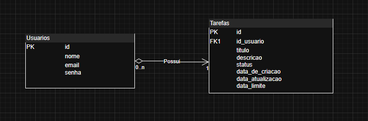

# Documentação Técnica: Sistema de Controle de Tarefas

## 1. Visão Geral da Arquitetura

Este projeto foi desenvolvido utilizando **PHP 8+(sem frameworks)**, seguindo os requisitos do desafio.  
A arquitetura adotada é uma abordagem de **"mini-API"**, onde o **Frontend (HTML/jQuery)** está totalmente desacoplado do **Backend (PHP)**.

O `index.php` atua como uma **Single Page Application (SPA)**.  
O JavaScript com jQuery é responsável pela **renderização dos dados e interações** com o usuário.  

O Backend (especificamente o ficheiro `src/actions/processa-tarefa.php`) funciona como um **endpoint de API centralizado** que recebe ações (ex: `?acao=listar`), processa os dados e retorna respostas **exclusivamente em formato JSON**.

---

## 2. Passos para Configuração Local

### Stack Necessária
- **XAMPP** com PHP 8+, MySQL e Apache  
- **Git**

### Clonar o Repositório
```bash
git clone https://github.com/Igorbarr3to/to-do_advanced.git
cd to-do_advanced
```

### Configurar o Servidor (XAMPP)
1. Mova a pasta `to-do_advanced` para dentro do diretório `htdocs` (ex: `C:/xampp/htdocs/`).
2. A pasta `public/` é a pasta raiz da aplicação.  
   O acesso deve ser feito via:  
   `http://localhost/to-do_advanced/public/`

### Base de Dados (MySQL)
1. Inicie o Apache e o MySQL no painel do XAMPP.  
2. Entre no **phpMyAdmin** via `http://localhost/phpmyadmin`.  
3. Crie uma nova base de dados (ex: `todo_advanced`).  
4. Importe o ficheiro `script.sql` (localizado na raiz do projeto) para criar a estrutura das tabelas.

### Arquivo de Conexão
O único arquivo de configuração do banco de dados está em `config/database.php`.  
Se a sua configuração do MySQL não for a padrão do XAMPP (usuário `root`, senha `''`),  
ajuste as credenciais na variável `$db` dentro deste arquivo.

---

## 3. Estrutura da Base de Dados e Relacionamentos

A base de dados é relacional, composta por duas tabelas principais com uma relação **1-para-N** (um usuário pode ter N tarefas).

### Diagrama de Entidade Relacionamento



### Código SQL (Estrutura Detalhada)

#### Tabela: `usuarios`
Armazena os dados de autenticação.  
A coluna `senha` armazena um **hash seguro** gerado por `password_hash()`.

```sql
CREATE TABLE usuarios (
  id INT PRIMARY KEY AUTO_INCREMENT,
  nome VARCHAR(255) NOT NULL,
  email VARCHAR(255) NOT NULL UNIQUE,
  senha VARCHAR(255) NOT NULL
);
```

#### Tabela: `tarefas`
Armazena as tarefas.  
`id_usuario` é a **chave estrangeira** que aponta para `usuarios.id`.

- `status`: ENUM('PENDENTE', 'CONCLUIDA')  
- `data_de_criacao`: preenchida automaticamente (`DEFAULT CURRENT_TIMESTAMP`)  
- `data_atualizacao`: atualizada em cada `UPDATE`

```sql
CREATE TABLE tarefas (
    id INT PRIMARY KEY AUTO_INCREMENT,
    titulo VARCHAR(50) NOT NULL,
    descricao VARCHAR(255),
    status enum('PENDENTE', 'CONCLUIDA') NOT NULL,
    data_de_criacao DATETIME NOT NULL DEFAULT CURRENT_TIMESTAMP,
    data_limite DATE,
    data_atualizacao DATETIME NOT NULL DEFAULT CURRENT_TIMESTAMP ON UPDATE CURRENT_TIMESTAMP,
    id_usuario INT NOT NULL, 

    FOREIGN KEY (id_usuario) REFERENCES usuarios(id)
);
```

---

## 4. Decisões Técnicas Adotadas

### Arquitetura de API (Backend)
O PHP é usado **puramente como uma API JSON**, sem renderizar HTML.  
Isso centraliza a lógica e deixa o frontend responsável por toda a **UX**.

### AJAX para Todas as Interações (Frontend)
Nenhuma ação principal (criar, editar, excluir, concluir, filtrar, paginar) causa recarregamento.  
Tudo é feito via **chamadas AJAX** que retornam JSON.

### Segurança
- **Prevenção de SQL Injection:** Todas as queries usam *Prepared Statements* (`mysqli_prepare`, `mysqli_stmt_bind_param`).  
- **Proteção de Endpoints:** Scripts em `src/actions/` (exceto login/registro) verificam `$_SESSION['id_usuario']`.  
  Se não estiver autenticado, retornam JSON 401 (Não Autorizado).  
- **Segurança de Dados (Ownership):** Updates e deletes incluem `AND id_usuario = ?` para impedir acesso indevido.

### UX (Frontend Libraries)
- **Notificações:** Usam *Bootstrap Toasts* com mensagens dinâmicas via JSON.  
- **Confirmações:** Substituição de `confirm()` pelo **SweetAlert2**.  
- **Filtro “Live”:** Busca automática com *debounce timer* no evento `keyup`.

---

## 5. Descrição dos Scripts PHP Principais

### `src/lib/` (Camada de Modelo – Lógica de BD)

#### `usuario.php`
- `buscarUsuarioPorEmail($db, $email)` – Verifica login.  
- `regitrarUsuario($db, …)` – Registra novo utilizador.

#### `tarefa.php`
- `buscarTarefasPorUsuario($db, …)` – Query dinâmica com filtros, status e paginação.  
- `criarTarefa(...)` – Executa `INSERT`.  
- `editarTarefa(...)` – Executa `UPDATE` com verificação de propriedade.  
- `concluirTarefa(...)` – Atualiza status para `'CONCLUIDA'`.  
- `excluirTarefa(...)` – Executa `DELETE` seguro.

### `src/actions/` (Camada de Controle)
- **`processa-registro.php`** – Valida e cadastra usuário.  
- **`processa-login.php` / `processa-logout.php`** – Gerenciam autenticação via `$_SESSION`.  
- **`processa-tarefa.php`** – Endpoint central da API.  
  - Inicia sessão e protege endpoint.  
  - Usa `switch ($_GET['acao'])` para rotear (`listar`, `criar`, `editar`, etc.).  
  - Chama as funções de modelo e retorna `json_encode(...)`.

---

## 6. Funcionamento das Requisições AJAX

O cérebro do frontend está no arquivo `public/index.php`, dentro da tag `<script>`.

### `$(document).ready(...)`
- Ao carregar, chama `listarTarefas(1)`.

### `listarTarefas(page = 1)`
1. Lê filtros `#filtroBusca` e `#filtroStatus`.  
2. Monta a URL (`...acao=listar&page=1&busca=Relatório`).  
3. Faz chamada `$.ajax` (GET).  
4. Renderiza dinamicamente as linhas da tabela e paginação.

### `#formNovaTarefa`
- `event.preventDefault()` impede recarregamento.  
- Serializa dados e envia via AJAX para `?acao=criar`.  
- Exibe toast, limpa o formulário e recarrega a lista.

### Botões de Ação (Delegação de Eventos)
- **Concluir:** Chama `?acao=concluir&id=...` via AJAX, altera DOM diretamente.  
- **Excluir:** Usa `Swal.fire()` para confirmar; em caso positivo, faz o DELETE via AJAX e remove a linha.

### `#formEditarTarefa`
- Envia via AJAX para `?acao=editar`.  
- Fecha o modal, mostra toast e atualiza lista.

### `#modalEditarTarefa`
- Ao abrir, preenche campos usando atributos `data-*` do botão clicado.

---

📄 **Fim da Documentação**
