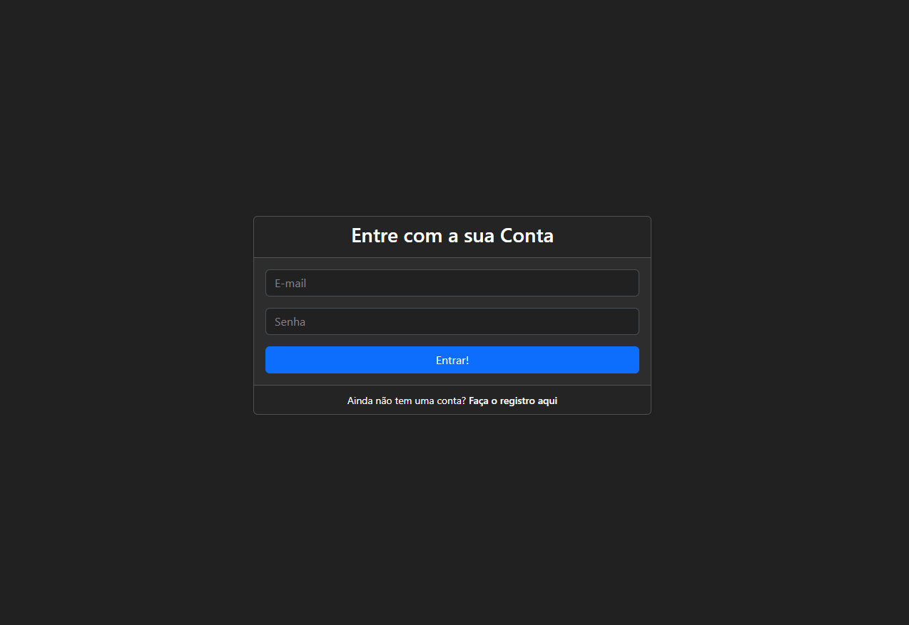
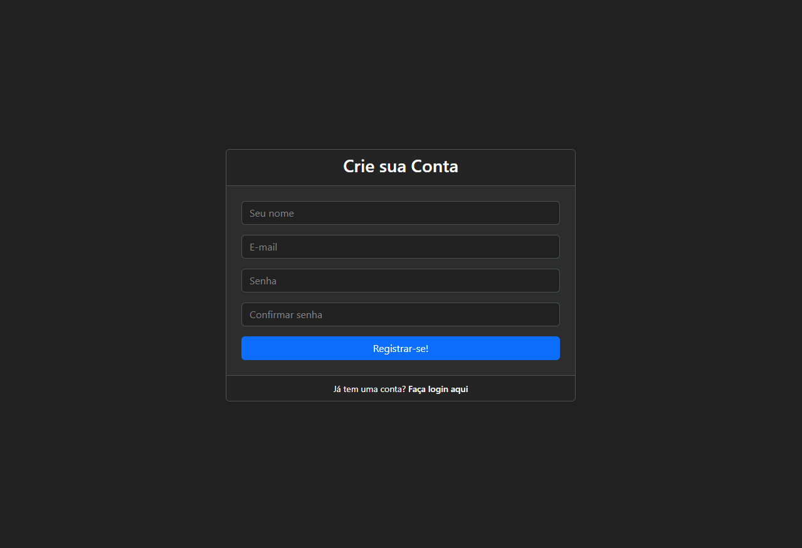
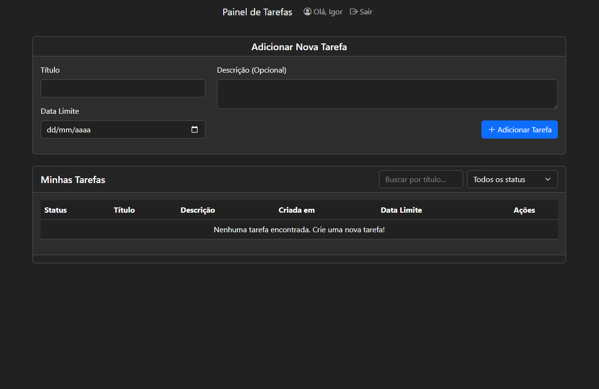

# Manual Funcional: Sistema de Controle de Tarefas

## 1. Descrição Geral do Sistema e Suas Telas 

Este é um sistema web gerenciamento de tarefas.

Uma aplicação de página única (Single Page Application): depois de fazer o login, você pode criar, editar, excluir, filtrar e concluir tarefas.
O layout é responsivo e se adapta a celulares, tablets e desktops.

### Telas do Sistema

* **Login (`login.php`):** A porta de entrada do sistema. Acesse com e-mail e senha.

* **Registro (`registro.php`):** Tela para criação de novos usuários, com validação de senha em tempo real.

* **Dashboard (`index.php`):** O centro de comando e tela principal. Ela é dividida em:
    * Formulário de Adição de Tarefas.
    * Formulário de Filtros (Busca por título e status).
    * Lista de Tarefas (a tabela principal).
    * Paginação (se houver muitas tarefas).

## 2. Passo a Passo para Utilização 

Siga este fluxo para usar o sistema.

### A. Autenticação

1.  **Registro:** Se for seu primeiro acesso, clique em "Faça o registro aqui" na tela de login. Preencha seu nome, e-mail e senha.
2.  **Login:** Após o registro, use seu e-mail e senha para entrar. Você será levado ao Dashboard.
3.  **Logout:** Para sair com segurança, clique no botão "Sair" no menu superior.

### B. Gerenciando Tarefas (No Dashboard)

* **Para Criar uma Tarefa:**
    1.  Use o card "Adicionar Nova Tarefa" no topo da página.
    2.  Preencha o Título (obrigatório), Data Limite e Descrição.
    3.  Clique em "Adicionar Tarefa".
    4.  A nova tarefa aparecerá instantaneamente no topo da sua lista.

* **Para Filtrar e Buscar:**
    1.  Use os campos da lista "Minhas Tarefas".
    2.  **Busca por Título:** Comece a digitar no campo "Buscar por título...". A lista se atualiza automaticamente enquanto você digita.
    3.  **Filtro por Status:** Selecione "Pendente" ou "Concluída" no menu. A lista se atualiza imediatamente.

* **Para Concluir uma Tarefa:**
    1.  Encontre a tarefa pendente na lista.
    2.  Clique no botão verde (ícone de "check").
    3.  A tarefa será marcada como concluída (texto riscado, status atualizado) e o botão de concluir desaparecerá.

* **Para Editar uma Tarefa:**
    1.  Clique no botão amarelo (ícone de "lápis") da tarefa desejada.
    2.  Um modal aparecerá com os dados atuais da tarefa.
    3.  Altere o título, status, data ou descrição.
    4.  Clique em "Salvar Alterações". O modal fechará e a lista será atualizada com os novos dados.

* **Para Excluir uma Tarefa:**
    1.  Clique no botão vermelho (ícone de "lixeira") da tarefa.
    2.  Um alerta aparecerá pedindo confirmação.
    3.  Se você confirmar, a tarefa será permanentemente excluída e sumirá da lista.

* **Para Navegar entre Páginas:**
    1.  Se você tiver mais tarefas do que o limite por página (5), controles de paginação (1, 2, 3...) aparecerão no final da tabela.
    2.  Clique em um número para ver as tarefas daquela página.

## 3. Instalação Local 

Para rodar este projeto no seu computador, você precisará do XAMPP.

1.  **Pré-requisito:** Baixe e instale o XAMPP.
2.  **Inicie o XAMPP:** Abra o Painel de Controle do XAMPP e clique em "Start" nos módulos **Apache** e **MySQL**.
3.  **Copie os Arquivos:** Clone ou cole a pasta do projeto na pasta `htdocs` do seu XAMPP (geralmente `C:/xampp/htdocs/`).
4.  **Crie o Banco de Dados:**
    * No seu navegador, acesse `http://localhost/phpmyadmin`.
    * Clique em "Novo" no menu lateral.
    * Dê um nome para o banco de dados (ex: `todo_advanced`) e clique em "Criar".
5.  **Importe as Tabelas:**
    * Clique no banco de dados que você acabou de criar (na lista da esquerda).
    * Clique na aba "Importar" no topo da página.
    * Clique em "Escolher arquivo" e selecione o arquivo `script.sql` que está na raiz do projeto.
    * Role para baixo e clique em "Executar".
6.  **Acesse o Sistema:**
    * Agora você pode acessar o projeto no seu navegador.
    * Digite a URL: `http://localhost/NOME_DA_PASTA_DO_PROJETO/public/`
    * (Exemplo: `http://localhost/to-do_advanced/public/`)